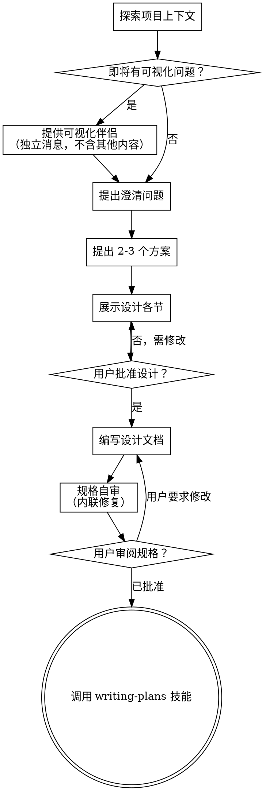

# 将创意头脑风暴转化为设计
通过自然流畅的协作对话，将想法转化为完整的设计方案和规范。

首先了解当前项目背景，然后逐一提出问题，逐步完善想法。一旦明确了要构建的内容，即可展示设计方案并获得用户认可。

<HARD-GATE>
在展示设计并获得用户批准之前，不要调用任何实现技能、编写任何代码、搭建任何项目或采取任何实现行动。这适用于每一个项目，无论看起来多么简单。
</HARD-GATE>

## 反模式："这太简单了，不需要设计"

每个项目都要走这个流程。一个待办清单、一个单函数工具、一个配置变更——统统都要。"简单"的项目恰恰是未经审视的假设导致最多浪费的地方。设计可以很短（真正简单的项目几句话就行），但你必须展示它并获得批准。

## 清单

你必须为以下每一项创建任务，并按顺序完成：

1. **探索项目上下文** —— 查看文件、文档、最近的提交
2. **提供可视化伴侣**（如果主题将涉及可视化问题）—— 这必须是独立的一条消息，不能和澄清问题合并。参见下面的可视化伴侣部分。
3. **提出澄清问题** —— 一次一个问题，理解目的/约束/成功标准
4. **提出 2-3 个方案** —— 附带权衡分析和你的推荐
5. **展示设计** —— 按复杂度分节呈现，每节后获得用户批准
6. **编写设计文档** —— 保存到 `docs/superpowers/specs/YYYY-MM-DD-<topic>-design.md` 并提交
7. **规格自审** —— 快速内联检查占位符、矛盾、歧义、范围（见下文）
8. **用户审阅书面规格** —— 请用户在继续之前审阅规格文件
9. **过渡到实现** —— 调用 writing-plans 技能创建实现计划

## 流程图

**终态是调用 writing-plans。** 不要调用 frontend-design、mcp-builder 或任何其他实现技能。brainstorming 之后你调用的唯一技能是 writing-plans。

## 具体流程

**理解想法：**

- 先查看当前项目状态（文件、文档、最近的提交）
- 在提出详细问题之前，请先评估项目范围：如果需求描述涉及多个相互独立的子系统（例如，“搭建一个包含聊天、文件存储、计费及数据分析功能的平台”），请务必立即予以标记。切勿将提问精力耗费在打磨此类项目的细节上，因为这类项目首先需要进行拆解。 
- 如果项目太大无法用单个规格描述，帮助用户拆分为子项目：独立的部分有哪些、它们如何关联、应该按什么顺序构建？然后通过正常的设计流程对第一个子项目进行头脑风暴。每个子项目有自己的 规格 → 计划 → 实现 循环。
- 对于范围合适的项目，逐一提问来细化想法
- 尽可能使用选择题，但开放式问题也可以
- 每条消息只问一个问题——如果某个话题需要更多探索，拆成多个问题
- 聚焦于理解：目的、约束、成功标准

**探索方案：**

- 提出 2-3 个不同方案，附带权衡分析
- 以对话方式展示选项，给出你的推荐和理由
- 首先展示你推荐的方案并解释原因

**展示设计：**

- 当你确信理解了要构建什么之后，展示设计
- 每节的详略程度与其复杂度匹配：简单的几句话，复杂的最多 200-300 字
- 每节之后询问目前看起来是否正确
- 覆盖：架构、组件、数据流、错误处理、测试
- 随时准备回过头来澄清不清晰的地方

**为隔离和清晰而设计：**

- 将系统分解为更小的单元，每个单元有明确的单一目的，通过定义良好的接口通信，并且可以独立理解和测试
- 对于每个单元，你应该能回答：它做什么、怎么使用它、它依赖什么？
- 不看内部实现，能理解一个单元做什么吗？改了内部实现，不会破坏使用方吗？如果不行，边界还需要打磨。
- 更小、边界清晰的单元对你来说也更容易操作——你对能一次性放入上下文的代码推理得更好，当文件聚焦时你的编辑也更可靠。当一个文件变大时，这通常是它承担了太多职责的信号。

**在现有代码库中工作：**

- 在提议变更之前，先探索当前结构。遵循已有模式。
- 如果现有代码存在影响当前工作的问题（例如文件变得过大、边界不清、职责纠缠），在设计中包含有针对性的改进——就像一个好开发者在工作的代码中做的那样。
- 不要提议无关的重构。专注于服务当前目标。

## 设计之后

**文档化：**

- 将经过验证的设计（规格）写入 `docs/superpowers/specs/YYYY-MM-DD-<topic>-design.md`
  - （用户对规格位置的偏好覆盖此默认值）
- 如果可用，使用 elements-of-style:writing-clearly-and-concisely 技能
- 将设计文档提交到 git

**规格自审：**
写完规格文档后，用全新的眼光审视它：

1. **占位符扫描：** 有任何 "TBD"、"TODO"、不完整的章节或模糊的需求吗？修复它们。
2. **内部一致性：** 各章节之间有矛盾吗？架构与功能描述匹配吗？
3. **范围检查：** 聚焦度足以用单个实现计划覆盖吗，还是需要进一步拆分？
4. **歧义检查：** 有任何需求可以被两种不同方式解读吗？如果有，选一种并明确写出。

内联修复所有问题。不需要重新审查——修复后继续即可。

**用户审阅门：**
规格审查循环通过后，请用户在继续之前审阅书面规格：

> "规格已写入并提交到 `<path>`。请审阅并告诉我是否想在开始编写实现计划之前做任何修改。"

等待用户的回复。如果他们要求修改，做出修改并重新运行规格审查循环。只有在用户批准后才继续。

**实现：**

- 调用 writing-plans 技能创建详细的实现计划
- 不要调用任何其他技能。writing-plans 是下一步。

## 核心原则

- **一次一个问题** —— 不要用多个问题淹没用户
- **优先使用选择题** —— 可能时比开放式问题更容易回答
- **严格执行 YAGNI** —— 从所有设计中移除不必要的功能
- **探索替代方案** —— 在确定之前始终提出 2-3 个方案
- **增量验证** —— 展示设计，在继续之前获得批准
- **保持灵活** —— 当某些内容不清楚时回过头来澄清

## 可视化伴侣

一个基于浏览器的伴侣，用于在头脑风暴过程中展示模型、图表和可视化选项。作为一种工具提供——不是一种模式。接受伴侣意味着它可以用于受益于可视化处理的问题；这并不意味着每个问题都要通过浏览器处理。

**提供伴侣：** 当你预感到即将提出的问题将涉及可视化内容（模型、布局、图表）时，征求一次同意：
> "我们正在做的事情中，有些如果能用浏览器展示给你看可能更容易解释。我可以随时组合模型、图表、对比和其他可视化内容。这个功能还比较新，可能会消耗较多 token。想试试吗？（需要打开一个本地 URL）"

**此提议必须是独立的一条消息。** 不要将它与澄清问题、上下文总结或任何其他内容合并。消息应该只包含上面的提议，不含其他内容。等待用户的回复再继续。如果他们拒绝，继续纯文本头脑风暴。

**逐问题决策：** 即使用户接受了，也要为每个问题单独决定是使用浏览器还是终端。判断标准：**用户通过看到它而不是阅读它，能更好地理解吗？**

- **使用浏览器** 处理本身就是可视化的内容——模型、线框图、布局对比、架构图、并排可视化设计
- **使用终端** 处理文本内容——需求问题、概念选择、权衡列表、A/B/C/D 文本选项、范围决策

关于 UI 主题的问题不自动就是可视化问题。"在这个上下文中 personality 意味着什么？"是一个概念问题——使用终端。"哪种向导布局更好？"是一个可视化问题——使用浏览器。

如果他们同意使用伴侣，在继续之前阅读详细指南：
`skills/brainstorming/visual-companion.md`
